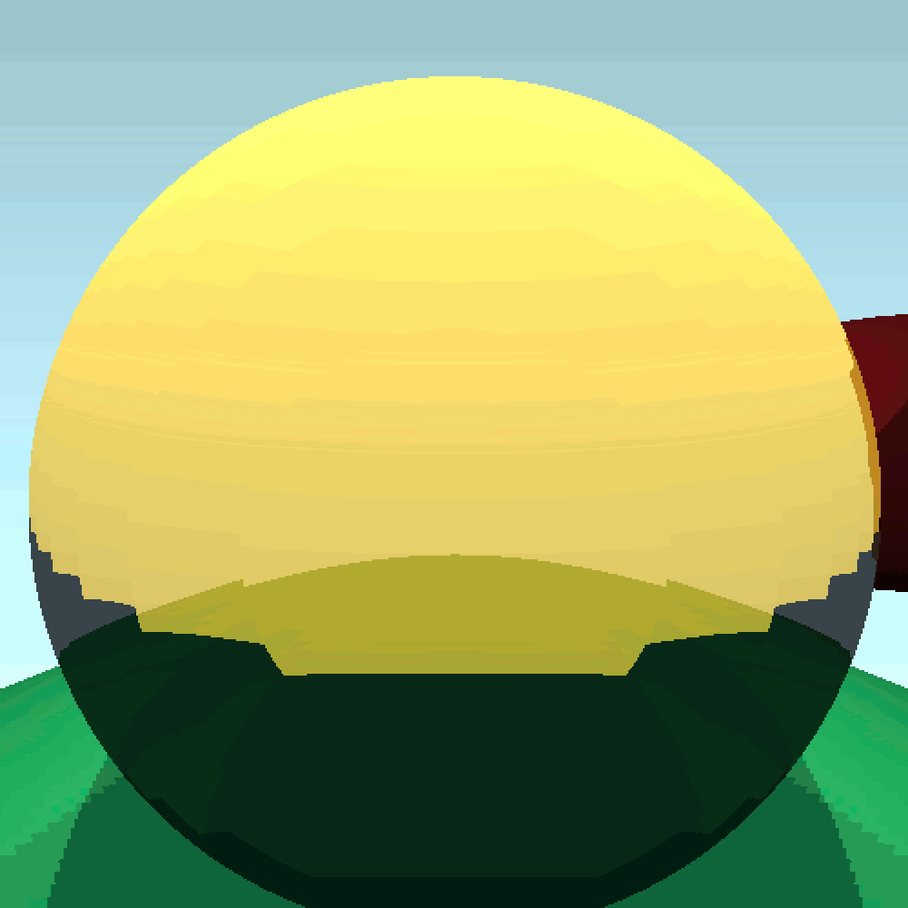
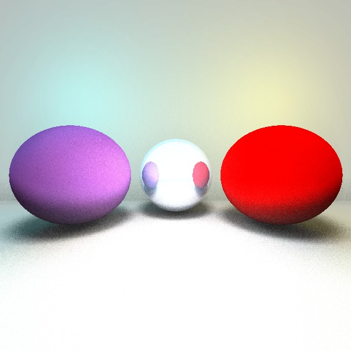

# **Non-Euclidean Ray Tracing** (Diploma thesis)





For my diploma thesis at the Faculty of Computer and Information Science of University of Ljubljana I implemented a ray tracing engine that also supports two non-euclidean spaces: **flat torus** and **spherical space**. As the focus of this project was the algorithm and experimentation, it was developed to run on the CPU instead of the GPU, therefore generating an image might take a while.

## Running the code
- `make` in the root directory
- `./Raytracing.out ./scenes/<scene_name>.txt`
  - If you also want to save the image, you can add the flag `--save` at the end

## Scene definition guide
You can define your own scenes in text files with the following format:
```
Camera (Tx Ty Tz) (Rx Ry Rz)
Light (Tx Ty Tz) (Cx Cy Cz)
Object (Tx Ty Tz) (Rx Ry Rz) (Sx Sy Sz) reflectivity translucency refractiveIndex color_type normalmap-none (Cx Cy Cz)
```
- `(Tx Ty Tz)` ... translation
- `(Rx Ry Rz)` ... rotation
- `(Sx Sy Sz)` ... scale
- `color_type ` can be `solid`, `checkerboard` or `gradient`
- `(Cx Cy Cz)` ... color in RGB (0 - 255)
- You should leave `normalmap_none` as it is; normal maps are a work in progress feature.
  
The scene can only have one camera, but you can define multiple objects and lights. 